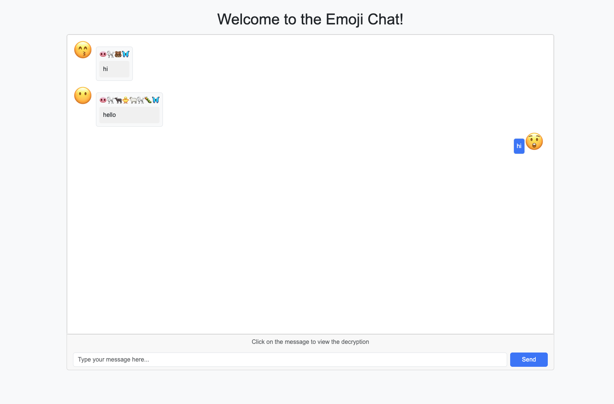

# Emoji-Chat

Emoji-Chat is a simple chat application that allows users to send messages as emoji.

Inspired by [obscure64](https://github.com/vvanglro/obscure64).

## Features



## Usage

1. Clone the repository:
   ```shell
   git@github.com:vvanglro/Emoji-Chat.git
   ```
2. Install dependencies:
   ```shell
   pdm install
   ```
3. Run the application:
   ```shell
   python main.py
   ```

## Deploy Emoji-Chat on Spaces

You can deploy Emoji-Chat on Spaces with just a few clicks:

[](https://huggingface.co/spaces/vvanglro/emoji-chat?duplicate=true)

Try Now:

https://vvanglro-emoji-chat.hf.space/

## TODO

- [x] Message storage, history messages
- [x] Multiple Chat Rooms
- [ ] Beautiful web page
- [ ] Message styles, e.g. return messages with only character emoji or animal emoji, etc.
- [ ] Share chat room link
- [ ] Chat Room Headcount
- [ ] Whether to display the original text
- [ ] Whether or not to obfuscate what you've sent
